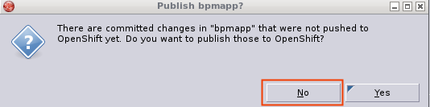
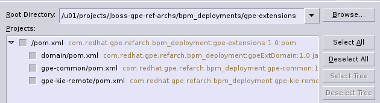
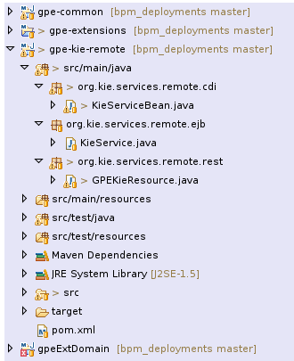
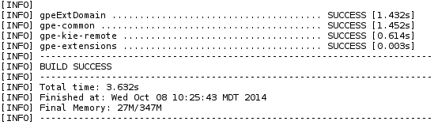

:data-uri:
:toc2:
:bpmproduct: link:https://access.redhat.com/site/documentation/en-US/Red_Hat_JBoss_BPM_Suite/[Red Hat's BPM Suite 6 product]
:dockerbpms: link:https://github.com/jboss-gpe-ose/docker_bpms/blob/master/doc/userguide.adoc[docker_bpms]
:osebpms: link:https://github.com/jboss-gpe-ose/openshift-origin-cartridge-bpms-full/blob/master/doc/cart_doc.adoc[OpenShift BPM cartridge]
:bpmmvn: link:https://access.redhat.com/documentation/en-US/Red_Hat_JBoss_BPM_Suite/6.0/html-single/Installation_Guide/index.html#The_JBoss_Integration_Maven_Repository[provided BPM Suite 6 Maven Repositories]
:mwlaboverviewsetup: link:http://people.redhat.com/jbride/labsCommon/setup.html[Middleware Lab Overview and Set-up]
:bz1108738: link://https://bugzilla.redhat.com/show_bug.cgi?id=1108738[Bugzilla 1108738]

image::images/rhheader.png[width=900]

:numbered!:
[abstract]
== BPM Suite 6: GPE Extensions

:numbered:

== Overview
The purpose of this portion of the *bpm_deployments* reference architecture is to demonstrate how to extend the BPM Suite 6 Execution Server to expose functions related to creation of process instance state graphs.
This ability was available in BRMS 5.3.1.
However, as of BPM Suite 6.0.3, equivalent functionality is not included out-of-the-box.

Currently, the GPE Extensions project provides the following additional functions :

. *startProcessAndReturnInflightVars*
+
Start a BPMN2 process instance and include process instance variable state in the response back to the client.
+
This is ideal for the use-case discussed in comment #3 of {bz1108738} :

.. The BPMN2 process does not define a wait-state (subsequently there is an opportunity to potentially use an in-memory KIE session strategy)
.. BAM is not necessary and is subsequently is disabled
.. pInstance vars are modified during execution of nodes
.. The final values of those modified pInstance variables are desired

. *listProcesses*
+
Given a deploymentId, return an array (in JSON format) of ids of BPMN2 processes that have previously been registered with the KieBase of a deployment unit.

. *getActiveNodeInfo*
+
Given a deploymentId and process instance Id, return an XML list of _ActiveNodeInfo_ elements.
This function is useful for diagraming the current state of process instances. 

== LEGAL

. This project is copyright of Red Hat, Inc. and distributed with an Apache 2 license
. This project is maintained by Red Hat's Global Partner Enablement team
. This project is a community project with no contractual support obligations
. Please contact Red Hat to discuss support details for Red Hat's BPM Suite 6 product.

== Pre-Requisites
The remainder of this documentation provides instructions for installation, configuration and execution of this reference architecture in Red Hat's Partner Demo System.
The following is a list of pre-requisites:

. OPENTLC-SSO credentials
+
`OPENTLC-SSO` user credentials are used to log into the Red Hat Partner Demo System (PDS).
If you do not currently have an `OPENTLC-SSO` userId, please email: `OPEN-program@redhat.com`.

. Familiarity with Partner Demo System
+
If you are not already familiar with Red Hat's `Partner Demo System`, please execute what is detailed in the {mwlaboverviewsetup} guide.
Doing so will ensure that you are proficient with the tooling and workflow needed to complete this reference architecture in an OpenShift Platform as a Service environment.

. Familiarity with {bpmproduct}
. curl

== Provision BPM Suite 6 application

. Open the `Openshift Explorer` panel of the `JBoss` perspective of JBDS
. Right-click on the previously created connection to `broker00.ose.opentlc.com`.
+
Using your `OPENTLC-SSO` credentials, a connection to `broker00.ose.opentlc.com` should already exist after having completed the {mwlaboverviewsetup} guide.

. Select: `New -> Application` .
+
Since you have already created a domain from the previous introductory lab, the workflow for creation of a new application will be slightly different than what you are used to.
In particular, the OSE plugin will not prompt you for the creation of a new domain.

. The following `New or existing OpenShift Application` pop-up should appear:
+
image::images/new_OSE_app_bpm.png[]

.. In the `Name` text box, enter: `bpmsapp`
.. From the `Type` drop-down, select: JBoss BPMS 6.0 (rhgpe-bpms-6.0)
.. From the `Gear profile` drop-down, select: pds_medium
. Click `Next`
. A new dialogue appears entitled `Set up Project for new OpenShift Aplication`.
+
Check the check box for `Disable automatic maven build when pushing to OpenShift`.
Afterwards, Click `Next`.

. A new dialogue appears entitled `Import an existing OpenShift application`.
+
Even though it will not be used, you will be forced to clone the remote git enabled project associated with your new OpenShift application.
Select a location on your local filesystem where the git enabled project should be cloned to.
+
image::images/gitclonelocation_bpm.png[]

. Click `Finish`
. The OSE plugin of JBDS will spin for a couple of minutes as the remote BPM Suite 6 enabled OpenShift application is created.
. Eventually, the OSE plugin will prompt with a variety of pop-up related details regarding your new application.
+
Click through all of them except when you come to the dialogue box entitled `Publish bpmsapp?`.
For this dialogue box, click `No`
+

=== BPM Suite 6 App Verification

. Using the `Remote System Explorer` perspective of JBDS, open an SSH terminal and tail the `bpms/standalone/log/server.log` of your remote BPM Suite 6 enabled OSE application
. Log messages similar to the following should appear:
+
image::images/newbpmlogfile.png[]

== Configuration and Execution

=== local: Clone this reference architecture
This reference architecture will be cloned both in your local computer as well as in your remote BPM Suite 6 Openshift environment.
To clone this reference architecture in your local environment, execute the following:

. Open the `Git` perspective of JBDS.
. In the `Git Repositories` panel, click the link that allows you to `Clone a Git Repository and add the clone to this view`
. A pop-up should appear with a name of `Source Git Repository`
. In the `URI` field, enter the following:
+
-----
https://github.com/jboss-gpe-ref-archs/bpm_deployments.git
-----

. Click `Next`
+

. Continue to click `Next` through the various screens
+
On the pop-up screen entitled `Local Destination`, change the default value of the `Directory` field to your preferred location on disk.
For the purposes of the remainder of these instructions, this directory on your local filesystem will be referred to as:  $REF_ARCH_HOME

. On the last screen of the `Clone Git Repository` pop-up, click `Finish`
+
Doing so will clone this `bpm_deployments` project to your local disk

. In JBDS, switch to the `Project Explorer` panel and navigate to:  `File -> Import -> Maven -> Existing Maven Projects`
. In the `Root Directory` field of the `Maven Projects` pop-up, navigate to the location on disk where the `bpm_deployments` project was just cloned to and select the `gpe-extensions` sub-project.
+

. Click `next` through the various pop-up panels and finally `Finish`.
. Your `Project Explorer` panel should now include the following mavenized projects
+

=== local: Build the Reference Architecture
The $REF_ARCH_HOME/gpe-extensions directory contains sub-modules that extend the BPM Suite 6 Execution Server:

. *domain*
+
Contains a `Driver` class that is used for testing this `gpe-extensions` reference architecture

. *gpe-common*
+
Contains a Java interface that defines functions that extend the BPM Suite 6 Execution Server.

. *gpe-kie-remote*
+
Contains a CDI bean, EJB service and JAX-RS based RESTful resource.
+

+
This functionality builds off each-other.
+
`KieServiceBean` is a CDI bean that directly extends the BPM Suite 6 Execution Server.
+
`KieService` is an EJB wrapper around the CDI bean and introduces transaction boundaries and provides a light-weight remoting API that EJB clients can invoke directly(optional).
+
`GPEKieResource` is a JAX-RS wrapper around the EJB service and exposes GPE Extension functions as RESTful resources.

To build the gpe-extensions project, execute the following:

. In the `Project Explorer` panel of JBDS, right-click on the `gpe-extensions` project
. Navigate to: `Run As -> Maven Install`
. In the `Console` panel, a `BUILD SUCCESS` log message should appear.
+
 
+
The end result are the following jar files:

** $REF_ARCH_HOME/gpe-extensions/domain/target/gpeExtDomain.jar
** $REF_ARCH_HOME/gpe-extensions/gpe-common/target/gpe-common-deployment.jar
** $REF_ARCH_HOME/gpe-extensions/gpe-kie-remote/target/gpe-kie-remote.jar

=== BPM Suite 6:  GPE Extensions Deployment

The GPE Extension artifacts that were previously built need to be deployed to the java classpath of BPM Suite 6 .
Do so as follows using the secure copy utility:

. Repeat these steps for the following artifacts

* $REF_ARCH_HOME/gpe-extensions/domain/target/gpeExtDomain.jar
* $REF_ARCH_HOME/gpe-extensions/gpe-common/target/gpe-common-deployment.jar
* $REF_ARCH_HOME/gpe-extensions/gpe-kie-remote/target/gpe-kie-remote.jar

.. In the `Project Explorer` panel of the `JBOSS` perspective of JBDS, right-click on the `domain/target/gpeExtDomain.jar` in `Project Explorer` and select `Copy`.
+

.. In the `Remote System Explorer` perspective of JBDS, navigate to `bpmsapp-<your domain>.apps.ose.opentlc.com -> Sftp Files -> My Home -> bpms -> standalone -> deployments -> business-central.war -> WEB-INF -> lib`
.. Right-click and select `Paste`
+
image::images/pastedomainjarintobizcentral.png[]

. Once all 3 artifacts have been added to the `WEB-INF/lib` directory of your remote BPM Suite 6 app, re-start the JVM:
.. Switch back to the `OpenShift Explorer` plugin of JBDS and right-click the `bpmsapp` application
.. Select `Restart Application`
. Once BPM Suite 6 starts back up, switch to the `Remote System Explorer` and ssh into your BPM Suite 6 enabled gear.
. Check the log file at `bpms/standalone/log/server.log` for entries similar to the following:
+
-----
INFO  [org.jboss.as.ejb3.deployment.processors.EjbJndiBindingsDeploymentUnitProcessor] (MSC service thread 1-6) JNDI bindings for session bean named kieService in deployment unit deployment "business-central.war" are as follows:

        java:global/business-central/kieService!org.kie.services.remote.IGPEKieService
        java:app/business-central/kieService!org.kie.services.remote.IGPEKieService
        java:module/kieService!org.kie.services.remote.IGPEKieService
        java:global/business-central/kieService
        java:app/business-central/kieService
        java:module/kieService
-----
+
This log entry indicates the GPE Extension EJB has been bound to JNDI and all is well.
We are now ready to test the new functionality.

=== BPM Suite 6:  Clone this reference architecture
This reference architecture has a simple BPMN2 process definition that can be used to to test our new GPE Extension functions.
+
image::modifyvars.png[]

Use the following steps to clone this reference architecture in BPM Suite 6:

. Log into the `BPM Console`  web application of BPM Suite 6
+
The userId to use is:  `jboss`  and the password to use is:  `brms`

. navigate to:  Authoring -> Administration.
. Select `Organizational Units` -> `Manage Organizational Units`
. Under `Organizational Unit Manager`, select the `Add` button
. Enter a name of _gpe_ and an owner of _jboss_. Click `OK`
. Clone this `bpm_deployments` git repository in BPM Suite 6
.. Select `Repositories` -> `Clone Repository` .
.. Populate the _Clone Repository_ box as follows and then click _Clone_ :

Enter _bpmdeployments as the value of the _repository name_.
The value of _Git URL_ is the URL to this reference architecture in github:

-----
https://github.com/jboss-gpe-ref-archs/bpm_deployments.git
-----

Once successfully cloned, BPM Suite 6 will pop-up a new dialog box with the message:  _The repository is cloned successfully_

=== BPM Suite 6:  Build and Deploy _soaProcessTier_ project
Build and Deploy the _soaProcessTier_ project by executing the following:

. Navigate to `Authoring -> Project Authoring`
. In the `Project Explorer` panel, ensure that `gpe -> bpmdeployments -> gpeExtProcessTier` is selected
+

. Navigate to `Authoring -> Project Authoring -> Tools -> Project Editor`
. In the `Project Editor` panel, click `Build and Deploy`

== Test

cd $REF_ARCH_HOME

=== *Start Process And Return Inflight Vars*

. In your local environment, execute the following RESTful command:
+
-----
curl -v -u jboss:brms -X POST -H "Content-Type:application/xml" -d @gpe-extensions/gpe-kie-remote/src/test/resources/StartProcess.xml http://<bpm-server-url>/business-central/rest/GPEKieResource/command
-----
+
Note: Replace <server-url> with the actual URL of your remote BPM Suite 6 server

. The response back should include modified process instance variables
+

=== *List Processes* Test

.  In your local environment, execute the following RESTful query:
+
-----
curl -v -u jboss:brms -X GET <bpm-server-url>/business-central/rest/GPEKieResource/com.redhat.gpe.refarch.bpm_deployments:gpeExtProcessTier:1.0/processes
-----
+
Note: Replace <server-url> with the actual URL of your remote BPM Suite 6 server

The HTTP response payload from invoking the new RESTful resource should include a list of ids (in JSON array format) of BPMN2 processes that have been registered with the KieBase corresponding to your Kie Project.
These process Ids should correspond with what was identified in step #2.

=== *GetActiveNodeInfo* Test
In the `Start Process And Return Inflight Vars` test, an instance of the `modifyVars` BPMN2 was instantiated.
Lets now retrieve the details of the active node of the current process instance.

. From the response from the `Start Process And Return Inflight Vars' test, make note of the Id of the new process instance.
. To retrieve an XML list of the active node, execute the following :
+
-----
curl -v -u jboss:brms -X GET <bpm-server-url>/business-central/rest/GPEKieResource/com.redhat.gpe.refarch.bpm_deployments:gpeExtProcessTier:1.0/process/activenodes/<pInstanceId>
-----
+
Note: Replace <server-url> with the actual URL of your remote BPM Suite 6 server

. The response body returned to the client should include a list of active node information.
This information is needed to diagram the state of a process instance.
+
-----
<activeNodeInfoList>
    <activeNodeInfo>
        <activeNode>
            <height>80</height>
            <name>_D6557EE3-C29B-4FD8-AD44-9BEC70208A53</name>
            <width>100</width>
            <x>345</x>
            <y>140</y>
        </activeNode>
        <diagramHeight>541</diagramHeight>
        <diagramWidth>932</diagramWidth>
    </activeNodeInfo>
</activeNodeInfoList>
-----

== To-Do

. Include process image arrow
. Provide javascript/CSS example of how to overlay the arrow on the process diagram given the active node information

ifdef::showscript[]

endif::showscript[]
