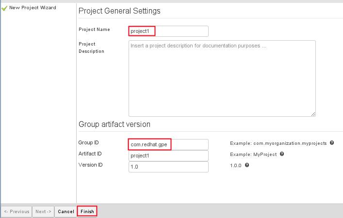
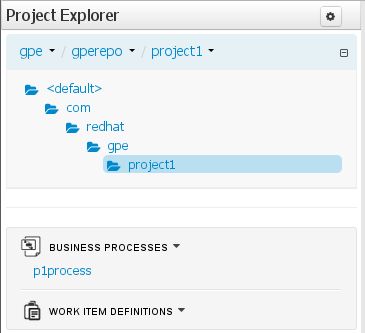
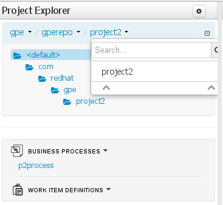

:data-uri:
:toc2:
:bpmproduct: link:https://access.redhat.com/site/documentation/en-US/Red_Hat_JBoss_BPM_Suite/[Red Hat's BPM Suite 6 product]
:dockerbpms: link:https://github.com/jboss-gpe-ose/docker_bpms/blob/master/doc/userguide.adoc[docker_bpms]
:bpmdownload: link:https://access.redhat.com/jbossnetwork/restricted/listSoftware.html?downloadType=distributions&product=bpm.suite&productChanged=yes[BPM Suite 6 Download site]
image::images/rhheader.png[width=900]

:numbered!:
[abstract]
== BPM Suite 6: Multi-Tenant BPM

:numbered:

== Overview
A BPM Suite 6 deployment in a production environment could be potentially multi-tenant.
Specifically, rules and BPMN2 process definitions for multiple client-organizations could potentially be managed by the same BPM Suite 6 server.

The purpose of this portion of the *bpm_deployments* reference architecture is to introduce both design and run-time configurations of a multi-tenant BPM Suite 6 production environment.
In particular, the following topics will be discussed:

. *BPM multi-tenancy best practices*
+

. *kie-cli-config commands*
+
The kie-cli-config utility included in the BPM Suite 6 _Supplementary Tools_ offers various commands to manipulate the associations between application defined roles and BPM organization units, git repos and projects.

This guide also includes instructions to execute a scenario that demonstrates BPM multi-tenancy.

== Pre-Requisites

. maven 3.0.5 (or greater)
. git client
. . familiarity with {bpmproduct}
. proficiency with basic *nix command line
. a BPM Suite 6 run-time environment such as that provided by the {dockerbpms} project

== BPM Multi-Tenancy Best Practices

== Intro to kie-config-cli
Multi-tenancy in BPM Suite 6 is implemented via Role-Based Access Control (RBAC).
User defined roles can be associated with BPM organizational units, git repositories and projects.
These associations are created by the _kie-config-cli_ tool included with the _Supplementary Tools_ of BPM Suite 6.

The *kie-config-cli* tool is a command line configuration tool that provides capabilities to manage the system repository from the command line.
What is meant by the _system repository_ is the bare git repository leveraged by BPM Suite 6 at *<org.uberfire.nio.git.dir>/system.git*.

[NOTE]
*org.uberfire.nio.git.dir* is an optional Java system property used by BPM Suite 6 that defines the path on local disk to all bare BPM repositories.
In the {dockerbpms} environment, the system property org.uberfire.nio.git.dir is set by default to:  /opt/jboss_bpm_soa/jboss-eap-6.1/bpmsGit/.niogit

The *kie-config-cli* tool can be used either in online or offline mode.

. *Online mode* (default and recommended) 
+ 
on startup, the tool connects to a Git repository using a Git server provided by BPM Console (which by default listens on port 8001). 
All changes are made locally and published to upstream only after explicitly executing the push-changes command. 
Use the exit command to publish local changes. 
To discard local changes on exit, use the discard command.

. *Offline mode* (a kind of installer style)
+
creates and manipulates the system repository directly on the server (there is no discard option).

== BPM Multi-Tenancy Lab Exercise
This section of the guide will demonstrate BPM multi-tenancy.

=== Start BPM Suite 6
Start your BPM Suite 6.0.2 environment and ensure that the Git server of BPM Console (which by default listens on port 8001) is enabled and accessible.

The Git server of BPM Console in the {dockerbpms} environment is running and exposed.

You'll need the ip address of your docker bpms container.
To determine the IP address, execute the following in a shell command terminal:

-----
sudo docker inspect --format='{{.NetworkSettings.IPAddress}}' <container.id>
-----

[NOTE]
Substitute the above with the value of your actual docker bpms containerId.

=== Create New Users / Roles in BPM ID Mgmt System
This exercise introduces two new users associated to two new roles.
In the default _docker bpms_ environment, user credentials are maintained in $JBOSS_HOME/standalone/configuration/application-*.properties .
Those credentials can be modified via the $JBOSS_HOME/bin/add-user.sh script.

. Create a user with id of *p1user* and role of *p1users*
+
-----
./bin/add-user.sh 

What type of user do you wish to add? 
 a) Management User (mgmt-users.properties) 
 b) Application User (application-users.properties)
(a): b

Enter the details of the new user to add.
Realm (ApplicationRealm) : 
Username : p1user
Password : 
Re-enter Password : 
What roles do you want this user to belong to? (Please enter a comma separated list, or leave blank for none)[  ]: p1users
About to add user 'p1user' for realm 'ApplicationRealm'
Is this correct yes/no? yes
Added user 'p1user' to file '/opt/jboss/eap/jboss-eap-6.1/standalone/configuration/application-users.properties'
Added user 'p1user' to file '/opt/jboss/eap/jboss-eap-6.1/domain/configuration/application-users.properties'
Added user 'p1user' with roles p1users to file '/opt/jboss/eap/jboss-eap-6.1/standalone/configuration/application-roles.properties'
Added user 'p1user' with roles p1users to file '/opt/jboss/eap/jboss-eap-6.1/domain/configuration/application-roles.properties'
Is this new user going to be used for one AS process to connect to another AS process? 
e.g. for a slave host controller connecting to the master or for a Remoting connection for server to server EJB calls.
yes/no? no
-----

. Create a second user with id of *p2user* and role of *p2users*

=== Download and unzip BPM *Supplementary Tools*
Using your Red Hat Network credentials, navigate your browser to the {bpmdownload}.
Download the *Supplementary Tools* to your local system.

Once completed, open a shell command terminal and unzip to your preferred location on disk:

-----
unzip ~/Downloads/jboss-bpms-brms-6.0.2.GA-redhat-5-supplementary-tools.zip  /opt/jboss/
-----

In your local system, you should now have the equivalent of the following directory:

-----
/opt/jboss/jboss-bpms-brms-6.0.2.GA-redhat-5-supplementary-tools
-----

For the remainder of this exercise, the above directory will be referred to as:  *$BPM_TOOLS_DIR*

=== Connect *kie-config-cli.sh* to BPM Suite 6 Git Server
Execute the following in a shell command terminal in your local system:

-----
cd $BPM_TOOLS_DIR/kie-config-cli-6.0.3-redhat-4-dist
./kie-config-cli.sh
-----

You'll be prompted with a dialogue similar to the following:

-----
************* Welcome to Kie config CLI ****************

>>Please Specify the location of the remote git system repository [ssh://localhost:8001/system]
ssh://172.17.0.16:8001/system
>>Please enter username:
jboss
>>Please enter password:

>>Please enter command (type help to see available commands):
-----

[NOTE]
In the above dialogue, you were prompted for the URL to the Git server of your docker bpms container.
Substitute the ip address used in the example above with the actual ip address of your docker bpms container determined previously.
The BPM administrator credentials are :  jboss / brms

Congradulations.  Your kie-config-cli tool is now connected in *online mode* to the remote Git Server of your docker bpms container.

=== Create an *Organizational Unit and bare git repo*
In this section of the exercise, an organizational unit and git repository will be created via the kie-config-cli tool.
At the kie-config-cli command prompt, execute the following:

-----
>>>>>>>>>>>>>>>>>>>>>>>>>>>
>>Please enter command (type help to see available commands):
create-org-unit
>>Organizational Unit name:gpe
>>Organizational Unit owner:jboss
>>Repositories (comma separated list):
Result:
Organizational Unit gpe successfully created
>>>>>>>>>>>>>>>>>>>>>>>>>>>
>>Please enter command (type help to see available commands): 
create-repo
>>Repository alias:gperepo
>>User:
>>Password:
>>Remote origin:
Result:
Repository with alias gperepo has been successfully created
>>>>>>>>>>>>>>>>>>>>>>>>>>>
>>Please enter command (type help to see available commands): 
add-repo-org-unit
>>Organizational Unit name:gpe
>>Repository alias:gperepo
Result:
Repository gperepo was successfully added to Organizational Unit gpe
>>>>>>>>>>>>>>>>>>>>>>>>>>>
-----

=== Create multiple *KIE projects*
Now that an organizational unit of *gpe* and a BPM bare git repo of *gperepo* have been created, the next step is to create two new KIE projects.
These new KIE projects will be version controlled in the *gperepo* git bare repository.
The names of the two KIE projects will be:  *project1* and *project2*

. KIE projects can not be created via the _kie-cli-config_ command line utility.
Subsequently, they must be created via the BPM Console of BPM Suite 6.
. Point your browser to the login screen of the BPM Console and login using the 'jboss' administrator user
. Navigate to:  Authoring -> Project Authoring -> New Item
. From the drop-down list, select *Project*
. A _Create new Project_ dialogue box will appear allowing for entry of a _Resource Name_.
Enter in a value of *project1*
. A second dialogue box called _Project General Settings_ will appear.
In the _Group ID_ text box, enter in a value of:  *com.redhat.gpe* and click _Finish_
+

. Repeat this procedure to create an additional new project called: *project2*

=== Associate New Roles to new KIE projects
Now that the *project1* and *project2* KIE projects have been created through the BPM Console, application-specific roles can be assigned to those projects.
By doing so, only thoses users with those application-specific roles will be able to see and modify those artifacts in those KIE projects.
Roles are associated to projects using the kie-cli-config utility.
The following demonstrates assigning a role of *p1users* to the *project1* KIE project:

-----
>>>>>>>>>>>>>>>>>>>>>>>>>>>
>>Please enter command (type help to see available commands): 
add-role-project
>>Repository alias:gperepo
>>Select project:
1) project1
2) project2
1
>>Security roles (comma separated list):p1users
Result:
Role p1users added successfully to project project1

>>>>>>>>>>>>>>>>>>>>>>>>>>>
-----

Repeat the above to assign a role of *p2users* to the *project2* KIE project.

=== Modify *Business-Central* Authorization policies
By default, the BPM Suite 6 Business Central web archive is locked down as per security configurations found in its WEB-INF/web.xml configuration file.
This default WEB-INF/web.xml config file needs to be modified to allow login authorization of users assigned the *p1users* and *p2users* roles to the BPM Console.
Do so as follows:

. ssh into your docker bpms environment, and open the following file in a command-line text editor:
*$JBOSS_HOME/standalone/deployments/business-central.war/WEB-INF/web.xml*
. In the section related to the *console* security constraints, add both the *p1users* and *p2users* roles
+
-----
    506   <security-constraint>
    507     <web-resource-collection>
    508       <web-resource-name>console</web-resource-name>
    509       <url-pattern>/org.kie.workbench.KIEWebapp/*</url-pattern>
    510       <url-pattern>*.erraiBus</url-pattern>
    511     </web-resource-collection>
    512     <auth-constraint>
    513       <role-name>admin</role-name>
    514       <role-name>analyst</role-name>
    515       <role-name>developer</role-name>
    516       <role-name>user</role-name>
    517       <role-name>manager</role-name>
    518       <role-name>p1users</role-name>
    519       <role-name>p2users</role-name>
    520     </auth-constraint>
    521   </security-constraint>
-----

. Do the same in the section related to the *formModeler* security constraints:
+
-----
    523     <security-constraint>
    524         <web-resource-collection>
    525           <web-resource-name>formModeler</web-resource-name>
    526           <url-pattern>/formModeler/*</url-pattern>
    527         </web-resource-collection>
    528         <auth-constraint>
    529           <role-name>admin</role-name>
    530           <role-name>analyst</role-name>
    531           <role-name>developer</role-name>
    532           <role-name>user</role-name>
    533           <role-name>manager</role-name>
    534           <role-name>p1users</role-name>
    535           <role-name>p2users</role-name>
    536         </auth-constraint>
    537     </security-constraint>
-----

. Define two new *security-roles* as follows:
+
-----
    564   <security-role>
    565     <role-name>p1users</role-name>
    566   </security-role>
    567   <security-role>
    568     <role-name>p2users</role-name>
    569   </security-role>
-----

These changes will authorize users with roles of either *p1users* and/or *p2users* with login access to the BPM Console.

=== Modify BPM Console Workbench properties
In the previous section, configuration changes were made to the business-central web artifact of BPM Suite 6 so as to authorize login access to users with application-specific roles.
In this section, the BPM Console will be further modified to associated the *p1users* and *p2users* roles with BPM Console workbench panels typically used by a business analyst.
Do so as follows:

. ssh into your docker bpms environment, and open the following file in a command-line text editor:
*$JBOSS_HOME/standalone/deployments/business-central.war/WEB-INF/classes/workbench-policy.properties
. In the *Granted roles per feature* section, add the *p1users* and *p2users* roles to the list of *roles.wb_for_business_analysts*
+
-----
     63 roles.wb_everything=admin
     64 roles.wb_for_developers=developer
     65 roles.wb_for_business_analysts=analyst,p1users,p2users
     66 roles.wb_for_business_users=user
     67 roles.wb_for_managers=manager
-----

. Re-start your BPM Suite 6 JVM

== Verify project-level multi-tenancy
Once your BPM Suite 6 environment has been bounced, you should be able to authenticate to the BPM Console as *p1user* .
Navigate to Authoring -> Project Authoring -> Project Explorer .
Notice that this *p1user* should only have visibility to the *project1* KIE project.
If interested, create and save a new BPMN2 process definition called:  *p1process* .

Log out of the BPM Console and log back in as the *p2user*.
Similar to previous, notice that this user only has visibility to the *project2* KIE projoct.

== To-Do

ifdef::showscript[]

endif::showscript[]

