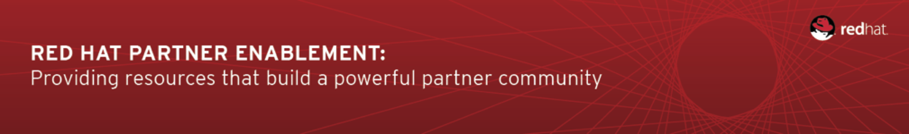

:data-uri:
:toc2:
:bpmproduct: link:https://access.redhat.com/site/documentation/en-US/Red_Hat_JBoss_BPM_Suite/[Red Hat's BPM Suite 6 product]
:dockerbpms: link:https://github.com/jboss-gpe-ose/docker_bpms/blob/master/doc/userguide.adoc[docker_bpms]
:bpmdownload: link:https://access.redhat.com/jbossnetwork/restricted/listSoftware.html?downloadType=distributions&product=bpm.suite&productChanged=yes[BPM Suite 6 Download site]

:numbered!:
[abstract]
== BPM Suite 6: Multi-Tenant BPM

:numbered:

== Overview
A BPM Suite 6 deployment in a production environment could be potentially multi-tenant.
Specifically, rules and BPMN2 process definitions for multiple client-organizations could potentially be managed by the same BPM Suite 6 server.

The purpose of this portion of the *bpm_deployments* reference architecture is to introduce both design and run-time configurations of a multi-tenant BPM Suite 6 production environment.
In particular, the following topics will be discussed:

. *BPM multi-tenancy best practices*
+

. *kie-cli-config commands*
+
The kie-cli-config utility included in the BPM Suite 6 _Supplementary Tools_ offers various commands to manipulate the associations between application defined roles and BPM organization units, git repos and projects.

This guide also includes instructions to execute a scenario that demonstrates BPM multi-tenancy.

== Pre-Requisites

. maven 3.0.5 (or greater)
. git client
. . familiarity with {bpmproduct}
. proficiency with basic *nix command line
. a BPM Suite 6 run-time environment such as that provided by the {dockerbpms} project

== BPM Multi-Tenancy Best Practices

== Intro to kie-config-cli
Multi-tenancy in BPM Suite 6 is implemented via Role-Based Access Control (RBAC).
User defined roles can be associated with BPM organizational units, git repositories and projects.
These associations are created by the _kie-config-cli_ tool included with the _Supplementary Tools_ of BPM Suite 6.

The *kie-config-cli* tool is a command line configuration tool that provides capabilities to manage the system repository from the command line.
What is meant by the _system repository_ is the bare git repository leveraged by BPM Suite 6 at *<org.uberfire.nio.git.dir>/system.git*.

[NOTE]
*org.uberfire.nio.git.dir* is an optional Java system property used by BPM Suite 6 that defines the path on local disk to all bare BPM repositories.
In the {dockerbpms} environment, the system property org.uberfire.nio.git.dir is set by default to:  /opt/jboss_bpm_soa/jboss-eap-6.1/bpmsGit/.niogit

The *kie-config-cli* tool can be used either in online or offline mode.

. *Online mode* (default and recommended) 
+ 
on startup, the tool connects to a Git repository using a Git server provided by BPM Console (which by default listens on port 8001). 
All changes are made locally and published to upstream only after explicitly executing the push-changes command. 
Use the exit command to publish local changes. 
To discard local changes on exit, use the discard command.

. *Offline mode* (a kind of installer style)
+
creates and manipulates the system repository directly on the server (there is no discard option).

== BPM Multi-Tenancy Lab Exercise
This section of the guide will demonstrate BPM multi-tenancy.

=== Start BPM Suite 6
Start your BPM Suite 6.0.2 environment and ensure that the Git server of BPM Console (which by default listens on port 8001) is enabled and accessible.

The Git server of BPM Console in the {dockerbpms} environment is running and exposed.

You'll need the ip address of your docker bpms container.
To determine the IP address, execute the following in a shell command terminal:

-----
sudo docker inspect --format='{{.NetworkSettings.IPAddress}}' <container.id>
-----

[NOTE]
Substitute the above with the value of your actual docker bpms containerId.

=== Download and unzip BPM *Supplementary Tools*
Using your Red Hat Network credentials, navigate your browser to the {bpmdownload}.
Download the *Supplementary Tools* to your local system.

Once completed, open a shell command terminal and unzip to your preferred location on disk:

-----
unzip ~/Downloads/jboss-bpms-brms-6.0.2.GA-redhat-5-supplementary-tools.zip  /opt/jboss/
-----

In your local system, you should now have the equivalent of the following directory:

-----
/opt/jboss/jboss-bpms-brms-6.0.2.GA-redhat-5-supplementary-tools
-----

For the remainder of this exercise, the above directory will be referred to as:  *$BPM_TOOLS_DIR*

=== Connect *kie-config-cli.sh* to BPM Suite 6 Git Server
Execute the following in a shell command terminal in your local system:

-----
cd $BPM_TOOLS_DIR/kie-config-cli-6.0.3-redhat-4-dist
./kie-config-cli.sh
-----

You'll be prompted with a dialogue similar to the following:

-----
************* Welcome to Kie config CLI ****************

>>Please Specify the location of the remote git system repository [ssh://localhost:8001/system]
ssh://172.17.0.16:8001/system
>>Please enter username:
jboss
>>Please enter password:

>>Please enter command (type help to see available commands):
-----

[NOTE]
In the above dialogue, you were prompted for the URL to the Git server of your docker bpms container.
Substitute the ip address used in the example above with the actual ip address of your docker bpms container determined previously.
The BPM administrator credentials are :  jboss / brms

Congradulations.  Your kie-config-cli tool is now connected in *online mode* to the remote Git Server of your docker bpms container.

=== Create an *Organizational Unit and bare git repo*

=== Create multiple *KIE projects*

-----

-----

== To-Do

ifdef::showscript[]

endif::showscript[]

