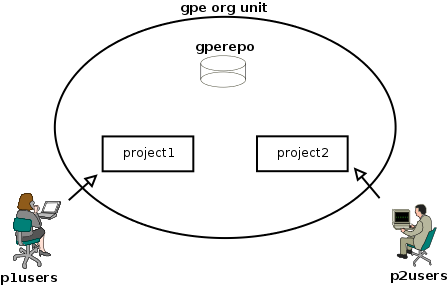
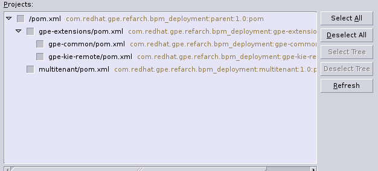
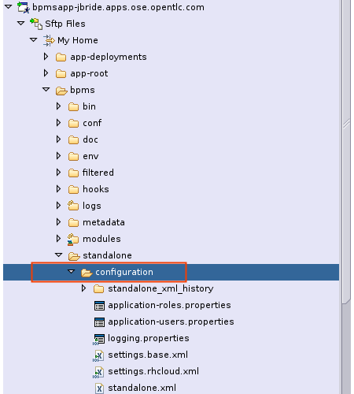

:data-uri:
:toc2:
:bpmproduct: link:https://access.redhat.com/site/documentation/en-US/Red_Hat_JBoss_BPM_Suite/[Red Hat's BPM Suite 6 product]
:bpmdownload: link:https://access.redhat.com/jbossnetwork/restricted/listSoftware.html?downloadType=distributions&product=bpm.suite&productChanged=yes[BPM Suite 6 Download site]
:mwlaboverviewsetup: link:http://people.redhat.com/jbride/labsCommon/setup.html[Middleware Lab Overview and Set-up]

image::images/rhheader.png[width=900]

:numbered!:
[abstract]
== BPM Suite 6: Multi-Tenant BPM

:numbered:

== Overview
A BPM Suite 6 deployment in a production environment could potentially be multi-tenant.
In other words, rules and BPMN2 process definitions for multiple client-organizations could potentially be managed by the same BPM Suite 6 server.
Users from one client-organization should only have visibility to their BPM design-time artifacts.

The purpose of this portion of the *bpm_deployments* reference architecture is to introduce an example of a multi-tenant BPM Suite 6 production environment.
In particular, the following topics will be discussed:

. *BPM multi-tenancy best practices*
+

. *kie-cli-config commands*
+
The kie-cli-config utility included in the BPM Suite 6 _Supplementary Tools_ offers various commands to manipulate the associations between application defined roles and BPM organization units, git repos and projects.

This guide also includes instructions to execute a scenario that demonstrates BPM multi-tenancy.

== BPM Multi-Tenancy Best Practices
=== Application defined roles
BPM Suite 6 implements Role-Based Access Control (RBAC) to define the policies that govern visibility to BPM artifacts via the BPM Console.
BPM Suite 6 comes stock with various pre-defined roles such as the following

. *admin*
+
Administrates the BPMS system. Has full access rights to make any changes necessary. 
Also has the ability to add and remove users from the system.
      
. *developer*
+
Implements code required for BPM artifacts to work.
Primary tool is JBDS however users of this role may also use the web tool occasionally

. *analyst*
+
Responsible for creating and designing processes into the system.
Creates process flows and handles process change requests.
Needs to test processes that they create.
Also creates forms and dashboards.

. *user*
+
Daily user of the system to take actions on business tasks that are required for the processes to continue forward.
Works primarily with the task lists.

. *manager*
+
Viewer-only User
Viewer of the system that is interested in statistics around the  business processes and their performance, business indicators, and other reporting of the system and people who interact with the system.

In addition to these stock roles, BPM Suite 6 allows for the creation and use of *application* defined roles.
For example, in the lab for this reference architecture, application defined roles of _p1users_ and _p2users_ will be created.
Users with a role of _p1users_ will only have visibility to the _project1_ KIE project.
Likewise, users with a role of _p2users_ will only have visibility to the _project2_ KIE project.

For BPM Suite 6 deployments that will be providing service for multiple client organizations, it is a best practice to create your own application defined roles.

== Intro to kie-config-cli
BPM Suite 6 implements Role-Based Access Control (RBAC) to define the policies that govern visibility to BPM artifacts via the BPM Console.
Roles can be associated with BPM organizational units, git repositories and projects.
These associations are created by the _kie-config-cli_ tool included with the _Supplementary Tools_ of BPM Suite 6.

The *kie-config-cli* tool is a command line configuration tool that provides capabilities to manage the system repository from the command line.
What is meant by the _system repository_ is the bare git repository leveraged by BPM Suite 6 at *<org.uberfire.nio.git.dir>/system.git*.

[NOTE]
*org.uberfire.nio.git.dir* is an optional Java system property used by BPM Suite 6 that defines the path on local disk to all bare BPM repositories.
In your remote BPM Suite 6 enabled OpenShift environment, the system property org.uberfire.nio.git.dir is set by default to:  ~/apps-root/data/bpmsGit/.niogit

The *kie-config-cli* tool can be used either in online or offline mode.

. *Online mode* (default and recommended) 
+ 
on startup, the tool connects to a Git repository using a Git server provided by BPM Console (which by default listens on port 8001). 
All changes are made locally and published to upstream only after explicitly executing the push-changes command. 
Use the exit command to publish local changes. 
To discard local changes on exit, use the discard command.

. *Offline mode* (a kind of installer style)
+
creates and manipulates the system repository directly on the server (there is no discard option).

== Pre-Requisites
The remainder of this documentation provides instructions for installation, configuration and execution of this reference architecture in Red Hat's Partner Demo System.
The following is a list of pre-requisites:

. OPENTLC-SSO credentials
+
`OPENTLC-SSO` user credentials are used to log into the Red Hat Partner Demo System (PDS).
If you do not currently have an `OPENTLC-SSO` userId, please email: `OPEN-program@redhat.com`.

. Familiarity with Partner Demo System
+
If you are not already familiar with Red Hat's `Partner Demo System`, please execute what is detailed in the {mwlaboverviewsetup} guide.
Doing so will ensure that you are proficient with the tooling and workflow needed to complete this reference architecture in an OpenShift Platform as a Service environment.

. Familiarity with {bpmproduct}
. proficiency with basic *nix command line
. Red Hat Network userId with sufficient entitlements to download the BPM Suite 6 _Supplementary Tools_.

== BPM Multi-Tenancy Lab 
This section of the guide will demonstrate project level multi-tenancy in BPM Suite 6.

At the conclusion of this exercise, your BPM Suite 6 environment will consist of the following as depicted in the above diagram:

. one organizational unit: *gpe*
. one bare git repository: *gperepo*
. two KIE projects
.. *project1*
.. *project2*

Users associated to a role of *p1users* will only have visibility to design-time artifacts in the *project1* KIE project.

Users associated to a role of *p2users* will only have visibility to design-time artifacts in the *project2* KIE project.

=== Provision BPM Suite 6 application

. Open the `Openshift Explorer` panel of the `JBoss` perspective of JBDS
. Right-click on the previously created connection to `broker00.ose.opentlc.com`.
+
Using your `OPENTLC-SSO` credentials, a connection to `broker00.ose.opentlc.com` should already exist after having completed the {mwlaboverviewsetup} guide.

. Select: `New -> Application` .
+
Since you have already created a domain from the previous introductory lab, the workflow for creation of a new application will be slightly different than what you are used to.
In particular, the OSE plugin will not prompt you for the creation of a new domain.

. The following `New or existing OpenShift Application` pop-up should appear:
+
image::images/new_OSE_app_bpm.png[]

.. In the `Name` text box, enter: `bpmsapp`
.. From the `Type` drop-down, select: JBoss BPMS 6.0 (rhgpe-bpms-6.0)
.. From the `Gear profile` drop-down, select: pds_medium
. Click `Next`
. A new dialogue appears entitled `Set up Project for new OpenShift Aplication`.
+
Check the check box for `Disable automatic maven build when pushing to OpenShift`.
Afterwards, Click `Next`.

. A new dialogue appears entitled `Import an existing OpenShift application`.
+
Even though it will not be used, you will be forced to clone the remote git enabled project associated with your new OpenShift application.
Select a location on your local filesystem where the git enabled project should be cloned to.
+
image::images/gitclonelocation_bpm.png[]

. Click `Finish`
. The OSE plugin of JBDS will spin for a couple of minutes as the remote BPM Suite 6 enabled OpenShift application is created.
. Eventually, the OSE plugin will prompt with a variety of pop-up related details regarding your new application.
+
Click through all of them except when you come to the dialogue box entitled `Publish bpmsapp?`.
For this dialogue box, click `No`
+
image::images/publishbpmslab.png[]

=== BPM Suite 6 App Verification

. Using the `Remote System Explorer` perspective of JBDS, open an SSH terminal and tail the `bpms/standalone/log/server.log` of your remote BPM Suite 6 enabled OSE application
. Log messages similar to the following should appear:
+
image::images/newbpmlogfile.png[]

=== local: Clone this reference architecture
This reference architecture will be cloned both in your local computer as well as in your remote BPM Suite 6 Openshift environment.
To clone this reference architecture in your local environment, execute the following:

. Open the `Git` perspective of JBDS.
. In the `Git Repositories` panel, click the link that allows you to `Clone a Git Repository and add the clone to this view`
. A pop-up should appear with a name of `Source Git Repository`
. In the `URI` field, enter the following:
+
-----
https://github.com/jboss-gpe-ref-archs/bpm_deployments.git
-----

. Click `Next`
+
image::images/clone_repo_to_local.png[]

. Continue to click `Next` through the various screens
+
On the pop-up screen entitled `Local Destination`, change the default value of the `Directory` field to your preferred location on disk.
For the purposes of the remainder of these instructions, this directory on your local filesystem will be referred to as:  $REF_ARCH_HOME

. On the last screen of the `Clone Git Repository` pop-up, click `Finish`
+
Doing so will clone this `bpm_deployments` project to your local disk

. In JBDS, switch to the `Project Explorer` panel and navigate to:  `File -> Import -> Maven -> Existing Maven Projects`
. In the `Root Directory` field of the `Maven Projects` pop-up, navigate to the location on disk where the `bpm_deployments` project was just cloned to.
. Click `next` through the various pop-up panels and finally `Finish`.
. Your `Project Explorer` panel should now include the following mavenized projects
+

=== Upload New Users/Roles to BPM Identity Mgmt System
This exercise introduces two new users associated with two new roles.

In the remote BPM Suite 6 OpenShift application, user credentials are maintained in `~/bpms/standalone/configuration/application-*.properties`.
This reference architecture includes user and role properties files that will over-ride the default user/role property files in the remote BPM Suite 6 OpenShift application.
The relevant `multitenant lab` sections of these updated property files are as follows:

. `$REF_ARCH_HOME/multitenant/conf/application-users.properties`
+
-----
# Multi-tenant lab:  passwords for p1user and p2user are both:  jb0ssredhat!
p1user=c44b62ff46d2273a63211e2e51379050
p2user=6cc4e87b185abf406b7f0e3fdfd2fc0f
-----
. `$REF_ARCH_HOME/multitenant/conf/application-roles.properties`
+
-----
# multi-tenant lab
p1user=p1users
p2user=p2users
-----

These two files need to be uploaded to BPM Suite 6.

. In the `Project Explorer` panel of JBDS, right-click on both properties files in `$REF_ARCH_HOME/multitenant/conf` and select `copy`
. Switch to the `Remote System Explorer` perspective and drop both files into the following location of your remote BPM Suite 6 OpenShift app:
`~/bpms/standalone/configuration`
+

=== Download and unzip BPM *Supplementary Tools*
The remote BPM Suite 6 OpenShift environment does not include the BPM Supplementary Tools.
Subsequently, they will need to be uploaded to your remote BPM Suite 6 app and execute from that environment

. Using your Red Hat Network credentials, navigate your browser to the {bpmdownload}.
. Download the *Supplementary Tools* zip file to your local system.
. Switch to the `Remote System Explorer` perspective of JBDS, use the `Sftp Files` capability to upload the supplementary-tools zip file to the following directory:
`~/app-root/data`
+
image::dropsuppzip.png[]

. Remain in the `Remote System Explorer` perspective of JBDS and open an ssh terminal to your remote BPM Suite 6 application.
. At the shell prompt, execute the following:
+
-----
unzip $OPENSHIFT_DATA_DIR/jboss-bpms-brms-6.0.2.GA-redhat-5-supplementary-tools.zip $OPENSHIFT_DATA_DIR
-----
+
In your remote BPM environment, you should now have the equivalent of the following directory:
+
-----
$OPENSHIFT_DATA_DIR/jboss-bpms-brms-6.0.2.GA-redhat-5-supplementary-tools
-----
+
For the remainder of this exercise, the above directory will be referred to as:  *$BPM_TOOLS_DIR*

=== Connect *kie-config-cli.sh* to BPM Suite 6 Git Server
Remain in the same shell command terminal of your remote BPM Suite 6 application and execute the following:

-----
cd $BPM_TOOLS_DIR/kie-config-cli-6.0.3-redhat-4-dist
./kie-config-cli.sh
-----

You'll be prompted with a dialogue similar to the following:

-----
************* Welcome to Kie config CLI ****************

>>Please Specify the location of the remote git system repository [ssh://localhost:8001/system]
ssh://172.17.0.16:8001/system
>>Please enter username:
jboss
>>Please enter password:

>>Please enter command (type help to see available commands):
-----

[NOTE]
In the above dialogue, you were prompted for the URL to the Git server of your remote bpms container.

=== Create an *Organizational Unit and bare git repo*
In this section of the exercise, an organizational unit and git repository will be created via the kie-config-cli tool.
In addition, the new organizational unit will be made owner of the new git repository.

At the kie-config-cli command prompt, execute the following:

-----
>>>>>>>>>>>>>>>>>>>>>>>>>>>
>>Please enter command (type help to see available commands):
create-org-unit
>>Organizational Unit name:gpe
>>Organizational Unit owner:jboss
>>Repositories (comma separated list):
Result:
Organizational Unit gpe successfully created
>>>>>>>>>>>>>>>>>>>>>>>>>>>
>>Please enter command (type help to see available commands): 
create-repo
>>Repository alias:gperepo
>>User:
>>Password:
>>Remote origin:
Result:
Repository with alias gperepo has been successfully created
>>>>>>>>>>>>>>>>>>>>>>>>>>>
>>Please enter command (type help to see available commands): 
add-repo-org-unit
>>Organizational Unit name:gpe
>>Repository alias:gperepo
Result:
Repository gperepo was successfully added to Organizational Unit gpe
>>>>>>>>>>>>>>>>>>>>>>>>>>>
-----

=== Create multiple *KIE projects*
Now that an organizational unit of *gpe* and a BPM bare git repo of *gperepo* have been created, the next step is to create two new KIE projects.
These new KIE projects will be version controlled in the *gperepo* git bare repository.
The names of the two KIE projects will be:  *project1* and *project2*

. KIE projects can not be created via the _kie-cli-config_ command line utility.
Subsequently, they must be created via the BPM Console of BPM Suite 6.
. Point your browser to the login screen of the BPM Console and login using the 'jboss' administrator user
. Navigate to:  Authoring -> Project Authoring -> New Item
. From the drop-down list, select *Project*
. A _Create new Project_ dialogue box will appear allowing for entry of a _Resource Name_.
Enter in a value of *project1*
. A second dialogue box called _Project General Settings_ will appear.
In the _Group ID_ text box, enter in a value of:  *com.redhat.gpe* and click _Finish_
+

. Repeat this procedure to create an additional new project called: *project2*

=== Associate New Roles to new KIE projects
Now that the *project1* and *project2* KIE projects have been created through the BPM Console, application-specific roles can be assigned to those projects.
By doing so, only thoses users with those application-specific roles will be able to see and modify those artifacts in those KIE projects.
Roles are associated to projects using the kie-cli-config utility.
The following demonstrates assigning a role of *p1users* to the *project1* KIE project:

-----
>>>>>>>>>>>>>>>>>>>>>>>>>>>
>>Please enter command (type help to see available commands): 
add-role-project
>>Repository alias:gperepo
>>Select project:
1) project1
2) project2
1
>>Security roles (comma separated list):p1users
Result:
Role p1users added successfully to project project1

>>>>>>>>>>>>>>>>>>>>>>>>>>>
-----

Repeat the above to assign a role of *p2users* to the *project2* KIE project.

=== Modify *Business-Central* Authorization policies
By default, the BPM Suite 6 Business Central web archive is locked down as per security configurations found in its WEB-INF/web.xml configuration file.
This default WEB-INF/web.xml config file needs to be modified to allow login authorization of users assigned the *p1users* and *p2users* roles to the BPM Console.
Do so as follows:

. ssh into your remote bpms environment, and open the following file in a command-line text editor:
*bpms/standalone/deployments/business-central.war/WEB-INF/web.xml*
. In the section related to the *console* security constraints, add both the *p1users* and *p2users* roles
+
-----
    506   <security-constraint>
    507     <web-resource-collection>
    508       <web-resource-name>console</web-resource-name>
    509       <url-pattern>/org.kie.workbench.KIEWebapp/*</url-pattern>
    510       <url-pattern>*.erraiBus</url-pattern>
    511     </web-resource-collection>
    512     <auth-constraint>
    513       <role-name>admin</role-name>
    514       <role-name>analyst</role-name>
    515       <role-name>developer</role-name>
    516       <role-name>user</role-name>
    517       <role-name>manager</role-name>
    518       <role-name>p1users</role-name>
    519       <role-name>p2users</role-name>
    520     </auth-constraint>
    521   </security-constraint>
-----

. Do the same in the section related to the *formModeler* security constraints:
+
-----
    523     <security-constraint>
    524         <web-resource-collection>
    525           <web-resource-name>formModeler</web-resource-name>
    526           <url-pattern>/formModeler/*</url-pattern>
    527         </web-resource-collection>
    528         <auth-constraint>
    529           <role-name>admin</role-name>
    530           <role-name>analyst</role-name>
    531           <role-name>developer</role-name>
    532           <role-name>user</role-name>
    533           <role-name>manager</role-name>
    534           <role-name>p1users</role-name>
    535           <role-name>p2users</role-name>
    536         </auth-constraint>
    537     </security-constraint>
-----

. Define two new *security-roles* as follows:
+
-----
    564   <security-role>
    565     <role-name>p1users</role-name>
    566   </security-role>
    567   <security-role>
    568     <role-name>p2users</role-name>
    569   </security-role>
-----

These changes will authorize users with roles of either *p1users* and/or *p2users* with login access to the BPM Console.

=== Modify BPM Console Workbench properties
In the previous section, configuration changes were made to the business-central web artifact of BPM Suite 6 so as to authorize login access to users with application-specific roles.
In this section, the BPM Console will be further modified to associated the *p1users* and *p2users* roles with BPM Console workbench panels typically used by a business analyst.
Do so as follows:

. ssh into your remote bpms environment, and open the following file in a command-line text editor:
*$JBOSS_HOME/standalone/deployments/business-central.war/WEB-INF/classes/workbench-policy.properties
. In the *Granted roles per feature* section, add the *p1users* and *p2users* roles to the list of *roles.wb_for_business_analysts*
+
-----
     63 roles.wb_everything=admin
     64 roles.wb_for_developers=developer
     65 roles.wb_for_business_analysts=analyst,p1users,p2users
     66 roles.wb_for_business_users=user
     67 roles.wb_for_managers=manager
-----

. Re-start your BPM Suite 6 JVM

=== Verify project-level multi-tenancy
==== p1users
Once your BPM Suite 6 environment has been bounced, you should be able to authenticate to the BPM Console as *p1user* .
Navigate to Authoring -> Project Authoring -> Project Explorer .
Notice that this *p1user* should only have visibility to the *project1* KIE project.
If interested, create and save a new BPMN2 process definition called:  *p1process* .

image::images/p1projectexplorer.png[]

==== p2users
Log out of the BPM Console and log back in as the *p2user*.
Similar to previous, notice that this user only has visibility to the *project2* KIE projoct.

image::images/p2projectexplorer.png[]

== To-Do

ifdef::showscript[]

endif::showscript[]

