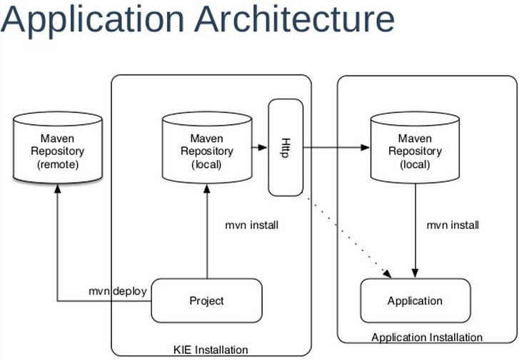

:data-uri:
:toc2:
:rhtlink: link:https://www.redhat.com[Red Hat]
:BZ1017327: link:https://bugzilla.redhat.com/show_bug.cgi?id=1017327[BZ1017327]
:DROOLS-139: link:https://issues.jboss.org/browse/DROOLS-139[Drools-139]
:execserverkiescanner: link:http://2.bp.blogspot.com/-emorAF0UQ1E/U7-2BOZlnJI/AAAAAAAAYL0/cCGLQCVLvbI/s1600/image4.png[execution server is configured to use the kie scanner]
:kmoduleSchema: link:https://github.com/droolsjbpm/droolsjbpm-knowledge/blob/6.0.x/kie-api/src/main/resources/org/kie/api/kmodule.xsd[kmodule.xml schema]
image::images/rhheader.png[width=900]

:numbered!:
[abstract]
== BPM Suite 6 Deployment

:numbered:

== Pre-Requisites
== Overview
The purpose of the reference architecture is to do a deep dive into BPM Suite 6 deployment topics of interest. 
The topics addressed are based on need or partner requests. The following topics are covered or planned:

== KIE Module
BPM Suite 6 uses the term *KIE Module*.  A KIE Module is a Maven Java project.  It differs from any other Maven Java
project by the existence of a `kmodule.xml` file in the META-INF folder.  kmodule.xml provides the module with configuration
information for kbases and ksessions.

Every KIE project must have a kmodule.xml file. An empty kmodule.xml file uses command defaults that include
every asset from all packages in the project. For complete details on the kmodule.xml file see the {kmoduleSchema}.

When a KIE project is built in business central the assets for the project are added to Kie Module jar files in the 
Maven repository.  BPM Suite 6 also maintains a folder structure that for the repository entries in a BPM artifact
repository.  The following system property determines the location of these folders:

.BPM Artifact Repository
----------
org.guvnor.m2repo.dir: Place where Maven repository folder will be stored. Default: working-directory/repositories/kie
----------

The BPM artifact repository is maintained by BPM Suite 6.  Do not manipulate the contents of this repository manually.

=== Kie Repository
KIE Modules that are successfully built are automatically added to a *Kie Repository* cache for available Kie Modules.
Each Kie Module within a Kie Repository is identified by a *ReleaseId*, which is derived from a combination of the Maven
Group Id, Artifact Id, and Version number properties.

=== KIE Module Types
Depending on the source of the assets, Kie Modules are loaded (and Deployment Units are created) using one of the following Kie Module Type handlers.

==== MemoryKieModule handler
When the _Build & Deploy_ button is pressed in the _Project Editor_ panel of BPM Console on a KIE project, all of the updated artifacts in the project are compiled in an incremental build and loaded by a *MemoryKieModule* handler.
The resultant KJar is subsequently deployed to a Maven repository (ie: either local or a remote maven repo such as Nexus).  
The MemoryKieModule handler logs an entry similar to the following:

--------
INFO   [org.drools.compiler.kie.builder.impl.KieRepositoryImpl] KieModule was added:MemoryKieModule[ ReleaseId=com.redhat.gpe.refarch.bpm_signalling:processTier:1.0]
--------

Of note is that the log entry includes the ReleaseId associated with the Kie Module.

==== ZipKieModule handler
In some scenarios, a KIE project has already been built and only a new deployment is needed.
Potential reasons for this scenario could be as follows:

. Deployment to a production environment
+
The production environment does not include the design-time functionality of BPM Console.
It only includes the runtime Execution Server.
The KIE project has already been built in a different environment via either the BPM Console, at the command line or via a Continouos Integration server.
The resultant KIE jar has already been pushed to either the maven repo or BPM artifact repo of the production environment.

. Deployment unit settings need to change
+
The KIE project has already been built and deployed however the settings of the deployment unit need to change (ie:  KIE session strategy needs to change from PER_PROCESS_INSTANCE to SINGLETON)

In these scenarios, *ZipKieModule* functionality is utilized.
*ZipKieModule* is used to read the KIE jars from the Maven repository.
Subsequently, new Deployment Units are created from these KIE jars.
Upon starting the BPM Suite 6 server, you may observe console log entries from the ZipKieModule if there are previously built artifacts available.
The console entry look like the following:

--------
INFO  [org.drools.compiler.kie.builder.impl.KieRepositoryImpl] KieModule was added:
ZipKieModule[ ReleaseId=org.drools:drools-wb-rest-defaultapprover:6.0.3-redhat-4
file=/Users/RHAdmin/RedHat/JBoss/supported/bpms602GA/jboss-eap-6.1/standalone/tmp/vfs/deploymenta90a06abb1d33a05/drools-wb-rest-defaultapprover-6.0.3-redhat-4.jar-56b93266ba9c411/drools-wb-rest-defaultapprover-6.0.3-redhat-4.jar]
--------

Notice that the log entry contains the ReleaseId for the Kie Module along with the file location from where the jar was loaded.

If the target KIE jar is not already in the maven repository, then the KIE jar will be automatically copied (via KieRepositoryScanner functionality) to the maven repository from the local BPM artifact repository.
If the target KIE jar is not in either the maven repository or the BPM artifact repository, the ZipKieModule handler will throw an exception.

==== File Kie Module handler
The File Kie Module is the least common of the three types of KIE module types.
BPM Suite 6 provides the ability to select assets to include in a Kie Module programmatically.  
In this case, the *KieFileSystem* class is used to gather the files into a Kie Module.
KieFileSystem also provides the ability to generate a Maven POM file for the module.
  

== Deployment Options
Deployments are KieModule JARs which can be deployed or undeployed.  The Business-Central application of BPM Suite 6 provides a User Interface (UI) for managing deployments.
For many organizations, this means of deployment is only suitable for development.  Production and test environments often require more automated deployment means.
This reference architecture describes these additional means of deploying Kie projects. 

=== Kie-Scanner Deployment
To understand Kie-Scanner deployment, Maven repositories must be discussed first.

Maven can either 'mvn install' to deploy a KieModule to the local machine, where all other applications on the local machine use it. 
Or it can 'mvn deploy' to push the KieModule to a remote Maven repository. Building the Application will pull in the KieModule and 
populate the local Maven repository.

After a KieModule is built, JARs can be deployed in one of two ways. A KieModule is either added to the classpath, like any other JAR in a Maven dependency listing, 
or a KieModule can be dynamically loaded at runtime.  The terms `classpath deployment` and `dynamic deployment` will be used to designate these two means of loading
a KieModule on a BPM Suite 6 server. 

For classpath deployment, KIE will scan the classpath to find all the JARs with a kmodule.xml in it. Each found JAR is represented by the KieModule interface. The
Kie-Scanner project, discussed below will provide an example of classpath deployment. 

The REST Deployment, discussed below, is one example of dynamic deployment. Dynamic deployment can also be done through the business-central UI.
While dynamic modules supports side by side versioning, classpath modules do not. 
Further once a module is on the classpath, no other version may be loaded dynamically.

=== Kie Scanner Project Introduction
==== Kie-Scanner Capabilities
==== org.kie.scanner.embedder.MavenEmbedder

Demonstrate deployment architecture where {execserverkiescanner}

=== KModuleDeploymentService

[IMPORTANT]
----------
Important to note is that when using RuntimeManager, KieSession instances are created by the RuntimeManager instead of by KieContainer 
but kmodule.xml (or model in general) is aways used as a base of the construction process. 
KieBase although is always taken from KieContainer.
----------

image::images/kmoduledeploymentservicestack.png[]

==== Comparison: KModuleDeploymentService and KieScanner
. why doesn't the Execution Server just use KIE scanner to detect the deployment / undeployment of the latest KIE jars

==== REST Deployment
The execution server within BPM Suite 6 provides a REST API that may be used to manage deployments.

Configuration options, such as the runtime strategy, should be specified when deploying the deployment: the configuration of a deployment can not be changed after it has already been deployed.

.Deployment via REST template
----------
curl -vv -u <user-id>:<user-password> -X POST http://<host>:<port>/business-central/rest/deployment/<deployment-id>/deploy?strategy=<runtime-strategy>
----------

- *<userId>* is the application user for BPM Suite 6
- *<user-password>* is the password for the above user
- *<host>* is the hostname or IP address for BPM Suite 6
- *<port>* is the port required for BPM Suite 6 (http or https port)
- *<deployment-id>* is an expression that contains the following elements, separated by a : character:
* group id
* artifact id
* version
* (optional) kbase id
* (optional) ksession id
- *<runtime-strategy>* is one of the three available runtime strategies of BPM Suite 6
* SINGLETON
* PER_PROCESS_INSTANCE
* PER_PROCESS

[NOTE]
.Runtime Strategies
==========
The session strategies have corresponding CDI annotations of @Singleton, @PerProcessInstance and @PerRequest. 
Their names refer to how the session context is managed. 

- `SINGLETON` maintains a single session context across all requests  
- `PER_PROCESS_INSTANCE` keeps session (context) for a process instance 
- `PER_PROCESS` is just stateless, no state is kept
==========

The following is an example use of the REST API to deploy a Kie Module.

.Deployment via REST Example
----------
curl -vv -u myUserId:myPassword -X POST http://localhost:8080/business-central/rest/deployment/com.redhat.gpe.refarch.bpm_signalling:processTier:1.0:bpmsignalling_base:bpmsignalling_session/deploy?strategy=PER_PROCESS_INSTANCE
----------

The REST call to undeploy a Kie project follows the same pattern, but without the strategy parameter

.Un-Deployment via REST template
----------
curl -vv -u <user-id>:<user-password> -X POST http://<host>:<port>/business-central/rest/deployment/<deployment-id>/undeploy
----------

Curl was used in the above examples, but the REST API enables any application with http client libraries to manage deployments via REST,
providing many options for managing deployments.

[WARNING]
.Deploy and Undeploy are asynchronous
==========
Both the /deploy and /undeploy operations are asynchronous REST operations.  This means that although each of these calls will typically return a status of 202 upon completion,
the requested operation has not been completed.  So the actual operation may actually fail.
==========

To determine that the REST call completed the deployment or undeployment call, use a REST, GET operation call to `/deployment/` to return a list of all available deployed
instances:

.Check the list of deployments
----------
curl -vv -u <user-id>:<user-password> -X GET http://<host>:<port>/business-central/rest/deployment/
----------

== Deploy to a Nexus repository
"Build & Deploy" performs a "maven install" and a "maven deploy".
Any additional repositories defined in the project's pom 
<distributionManagement> section are honored (with appropriate 
authentication credentials taken from settings.xml's <repository> elements)

. start local nexus
. start business-central ver 6.0.2
. create project in business-central
. clone the repo to a local environment
. add distributionMagt on the pom.xml

+
-----
<distributionManagement>
   <repository>
      <id>deployment</id>
      <name>Internal Releases</name>
      <url>http://localhost:8081/nexus/content/repositories/releases/</url>
   </repository>
   <snapshotRepository>
     <id>deployment</id>
     <name>Internal Releases</name>
     <url>http://localhost:8081/nexus/content/repositories/snapshots/</url>
  </snapshotRepository>
</distributionManagement>
-----
    
. push changes to business-central repo
. click "build and deploy" on business central,  it deploys to remote nexus repository.

== Enterprise Deployment

Above image taken from pg 27 of link:http://www.slideshare.net/MarkProctor/drools-6-overview[mark proctor's drools overview presentation]

== Continuous Integration Deployment

=== CI Deployment options

=== CI Deployment Project Introduction

== Cluster Deployment

=== Clustering BPM Suite 6

=== JBoss EAP Clustering Overview

=== Cluster Deployment Project Introduction

== Deployment descriptor per deployment

{BZ1017327}

== Infinispan based drools and jbpm persistence
** {Drools-139}
** this has been merged in upstream community droolsjbpm-integration
** what's the timeline for getting this in a supported release ?

== To-Do
