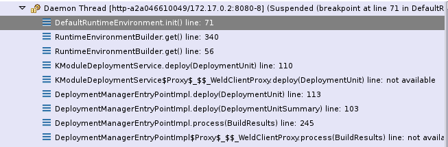

:data-uri:
:toc2:
:rhtlink: link:https://www.redhat.com[Red Hat]
:BZ1017327: link:https://bugzilla.redhat.com/show_bug.cgi?id=1017327[BZ1017327]
:DROOLS-139: link:https://issues.jboss.org/browse/DROOLS-139[Drools-139]
:execserverkiescanner: link:http://2.bp.blogspot.com/-emorAF0UQ1E/U7-2BOZlnJI/AAAAAAAAYL0/cCGLQCVLvbI/s1600/image4.png[execution server is configured to use the kie scanner]

image::images/rhheader.png[width=900]

:numbered!:
[abstract]
== BPM Suite 6 Deployment

:numbered:

== Pre-Requisites
== Overview
The purpose of the reference architecture is to do a deep dive into BPM Suite 6 deployment topics of interest. 
The topics addressed are based on need or partner requests. The following topics are covered or planned:

== KIE module types
=== FileKieModule
=== MemoryKieModule
=== ZipKieModule

== Deployment Options
Deployments are KieModule JARs which can be deployed or undeployed.  The Business-Central application of BPM Suite 6 provides a User Interface (UI) for managing deployments.
For many organizations, this means of deployment is only suitable for development.  Production and test environments often require more automated deployment means.
This reference architecture describes these additional means of deploying Kie projects. 

=== Kie-Scanner Deployment
==== Kie-Scanner Capabilities
==== org.kie.scanner.embedder.MavenEmbedder

Demonstrate deployment architecture where {execserverkiescanner}

=== KModuleDeploymentService

==== Comparison: KModuleDeploymentService and KieScanner
. why doesn't the Execution Server just use KIE scanner to detect the deployment / undeployment of the latest KIE jars

==== REST Deployment
The execution server within BPM Suite 6 provides a REST API that may be used to manage deployments.

Configuration options, such as the runtime strategy, should be specified when deploying the deployment: the configuration of a deployment can not be changed after it has already been deployed.

.Deployment via REST template
----------
curl -vv -u <user-id>:<user-password> -X POST http://<host>:<port>/business-central/rest/deployment/<deployment-id>/deploy?strategy=<runtime-strategy>
----------

- *<userId>* is the application user for BPM Suite 6
- *<user-password>* is the password for the above user
- *<host>* is the hostname or IP address for BPM Suite 6
- *<port>* is the port required for BPM Suite 6 (http or https port)
- *<deployment-id>* is an expression that contains the following elements, separated by a : character:
* group id
* artifact id
* version
* (optional) kbase id
* (optional) ksession id
- *<runtime-strategy>* is one of the three available runtime strategies of BPM Suite 6
* SINGLETON
* PER_PROCESS_INSTANCE
* PER_PROCESS

The following is an example use of the REST API to deploy a Kie Module.

.Deployment via REST Example
----------
curl -vv -u myUserId:myPassword -X POST http://localhost:8080/business-central/rest/deployment/com.redhat.gpe.refarch.bpm_signalling:processTier:1.0:bpmsignalling_base:bpmsignalling_session/deploy?strategy=PER_PROCESS_INSTANCE
----------

The REST call to undeploy a Kie project follows the same pattern, but without the strategy parameter

.Un-Deployment via REST template
----------
curl -vv -u <user-id>:<user-password> -X POST http://<host>:<port>/business-central/rest/deployment/<deployment-id>/undeploy
----------

Curl was used in the above examples, but the REST API enables any application with http client libraries to manage deployments via REST,
providing many options for managing deployments.

NOTE:
**************
Both the /deploy and /undeploy operations are asynchronous REST operations.  This means that although each of these calls will typically return a status of 202 upon completion,
the requested operaiton has not been completed.  So the actual operation may actually fail.
**************

== Deploy to a Nexus repository
"Build & Deploy" performs a "maven install" and a "maven deploy".
Any additional repositories defined in the project's pom 
<distributionManagement> section are honoured (with appropriate 
authentication credentials taken from settings.xml's <repository> elements)

. start local nexus
. start business-central ver 6.0.2
. create project in business-central
. clone the repo to a local environment
. add distribuitonMagt on the pom.xml

+
-----
<distributionManagement>
   <repository>
      <id>deployment</id>
      <name>Internal Releases</name>
      <url>http://localhost:8081/nexus/content/repositories/releases/</url>
   </repository>
   <snapshotRepository>
     <id>deployment</id>
     <name>Internal Releases</name>
     <url>http://localhost:8081/nexus/content/repositories/snapshots/</url>
  </snapshotRepository>
</distributionManagement>
-----
    
. push changes to business-central repo
. click "build and deploy" on business central,  it deploys to remote nexus repository.

== Continuous Integration Deployment

=== CI Deployment options

=== CI Deployment Project Introduction

== Cluster Deployment

=== Clustering BPM Suite 6

=== JBoss EAP Clustering Overview

=== Cluster Deployment Project Introduction

== Deployment descriptor per deployment

{BZ1017327}

== Infinispan based drools and jbpm persistence
** {Drools-139}
** this has been merged in upstream community droolsjbpm-integration
** what's the timeline for getting this in a supported release ?

== To-Do
