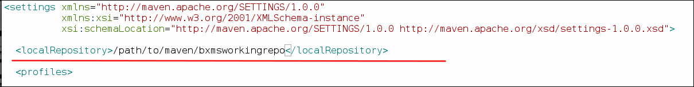

= *Standalone Complex Event Processing*

:data-uri:
:toc: manual
:toc-placement: preamble
:droolsjavadoc: link:https://docs.jboss.org/drools/release/latest/kie-api-javadoc/[Drools Java API]
:bpmproduct: link:https://access.redhat.com/site/documentation/en-US/Red_Hat_JBoss_BPM_Suite/[Red Hat's BPM Suite 6 product]
:cepdocs: link:https://access.redhat.com/documentation/en-US/Red_Hat_JBoss_BRMS/6.0/html-single/Development_Guide/index.html#chap-Complex_Event_Processing[complex event processing]
:numbered:

Standalone Complex Event Processing Quickstart using JBoss BRM Suite 6.1 libraries

== Overview

Red Hat sells subscriptions to its fully supported Business Rules Management System (BRMS).
The default deployment of this product is as a web application executing on the JBoss Enterprise Application Platform (EAP).
Interaction to this _BRMS server_ is typically via its REST APIs.
This default _BRMS server_ deployment topology is ideal for many large enterprise scenarios where it is ideal to have the rules engine centralized, optimized and configured for high-availability.

Red Hat's BRMS product is, however, also fully supported when embedded directly in a business application.
The business application would, in this case, make direct use of the {droolsjavadoc}.

== Purpose
The purpose of this quickstart is to demonstrate creation and execution of a mavenized _Complex Event Processing_ (CEP) project using supported JBoss BRMS libraries.
This CEP project could then be leveraged in the source code of a business application that is need of embedding BRMS and invoking its CEP engine.

== Prerequisites

. Experience with the rules and CEP engines of BRMS
+
The CEP engine is discussed in length in Red Hat GPE's _Business Logic Developer_ course.
+
In addition, the following is developer documentation on {cepdocs} using BRMS.
. JDK 1.7 (or more recent) installed on your local workstation
. maven v3.2.5 (or more recent ... ie:  3.3.1) installed on your local workstation
+
[NOTE]
Older versions of maven (tested on RHEL 7) are known to not work with this quickstart.

== Configure Local BxMS Maven Repository
This project will make use of JBoss BRMS 6.1 libraries.

[NOTE]
JBoss BRMS 6.1 is currently available as part of the _Early Adopter_ program.
Contact your Red Hat account manager to apply to this program.

=== Acquire Red Hat Maven Repositories
This quickstart will make use of a supported BxMS Maven repository installed on your local workstation.

In particular: *jboss-brms-bpmsuite-6.1.0.GA-maven-repository.zip*

[NOTE]
Because BRMS 6.1 is only available from the _Early Adopter_ program, request this zip of mavenized BRMS libraries from your Red Hat account manager.

Once downloaded, unzip :

-----
unzip jboss-brms-bpmsuite-6.1.0.GA-maven-repository.zip -d /path/to/repo
-----

[NOTE]
Replace _/path/to/repo_ with the preferred location on your local workstation for managing Maven repositories.

=== Maven settings.xml

The BxMS Maven repo includes a sample settings.xml at:

-----
/path/to/repo/jboss-brms-bpmsuite-6.1.0.GA-redhat-1-maven-repository/example-settings.xml
-----

In your favorite text editor, open that file and make the following changes:

. Add a <localRepository> element
+
In order to not interfere with any existing local maven repositories that may already be on your workstation (typically ~/.m2/repository), a _localRepository> tag should be added:
+

+
Replace _/path/to/maven_ with the preferred location on your local workstation for managing Maven repositories.

. Modify path to unzipped local BxMS repo
+
image::images/example_settings.png[]
+
Replace _/path/to/repo with the path that the BxMS Maven repo download was unzipped to.

== Create Maven Project

. Create a simple CEP project with dependencies on supported BxMS libraries:
+
-----
mvn archetype:generate \
    -DarchetypeGroupId=org.kie \
    -DarchetypeArtifactId=kie-drools-archetype \
    -DgroupId=org.acme \
    -DartifactId=drools_cep \
    -Dversion=1.0 \
    -DexampleWithCEP \
    -DpomEclipseCompatible \
    -Dslf4jVersion=1.7.2 \
    -DinteractiveMode=false \
    -DdroolsVersion=6.2.0.Final-redhat-3
-----
+
After a while (depending on download speeds of your network), a new directory called _drools_cep_ should be created.
. cd drools_cep
. mvn -v
+
-----
$ mvn -v
Apache Maven 3.3.1 (cab6659f9874fa96462afef40fcf6bc033d58c1c; 2015-03-13T14:10:27-06:00)
Maven home: /opt/apache/apache-maven-3.3.1
Java version: 1.7.0_75, vendor: Oracle Corporation
Java home: /usr/lib/jvm/java-1.7.0-openjdk-1.7.0.75-2.5.4.2.el7_0.x86_64/jre
-----
+
As mentioned in the pre-reqs, ensure use of a recent version of Maven on your $PATH (ie:  v3.2.5 or v3.3.1)

. mvn clean install -DskipTests -s /path/to/repo/example-settings.xml
+
This command will compile and install the _drools_cep_ project.
+
After a while, you should see the statement: _BUILD SUCCESS_ .

== Execute Standalone CEP Test
The new mavenized _drools_cep_ project previously created contains a JUnit test class that demonstrates use of the BRMS CEP engine.
Execute this test as follows:

. cd /path/to/new/drools_cep
. mvn clean test
+
In your terminal window, you should see the following :
+
-----
2015-03-31 12:26:30,127 INFO  [org.acme.RuleTest] (main) Creating kieBase with STREAM option
2015-03-31 12:26:30,226 INFO  [org.acme.RuleTest] (main) There should be rules:
2015-03-31 12:26:30,226 INFO  [org.acme.RuleTest] (main) kp [Package name=org.acme] rule colors seen in the last 2 minutes
2015-03-31 12:26:30,226 INFO  [org.acme.RuleTest] (main) Creating kieSession
2015-03-31 12:26:30,314 INFO  [org.acme.RuleTest] (main) Populating globals
2015-03-31 12:26:30,314 INFO  [org.acme.RuleTest] (main) Now running data
2015-03-31 12:26:30,334 INFO  [org.acme.RuleTest] (main) Final checks
Tests run: 1, Failures: 0, Errors: 0, Skipped: 0, Time elapsed: 1.096 sec - in org.acme.RuleTest
-----
. Review the following quickstart functionality to understand the CEP test:
.. `drools_cep/src/main/resources/rules.drl`
.. `drools_cep/src/test/java/org/acme/RuleTest.java`
+
Notice the use of the KIE / Drools Java API in this class to initialize a KnowledgeBase and drive the CEP engine using a _pseudo_ clock.

Congratulations!  You have successfully created and executed a simple BRMS project that makes use of the CEP engine.

== Review pertinent project artifacts:

=== pom.xml

The _drools_cep/pom.xml_ defines dependencies and versions that you'll want to include in the maven configurations of your business application.

. *drools-version*
+
Notice that the value corresponds to the _droolsVersion_ system property specified previously when the maven archetype command was executed:
+
-----
 <drools-version>6.2.0.Final-redhat-3</drools-version>
-----

. *dependencyManagement*
+
The supported BxMS supported Maven repository includes a single bill of materials (BOM) artifact that greatly simplifies configuration of maven dependencies.
+
-----
 21         <dependencyManagement>
 22                 <dependencies>
 23                         <dependency>
 24                                 <groupId>org.drools</groupId>
 25                                 <artifactId>drools-bom</artifactId>
 26                                 <type>pom</type>
 27                                 <version>${drools-version}</version>
 28                                 <scope>import</scope>
 29                         </dependency>
 30                 </dependencies>
 31         </dependencyManagement>
-----
+
This _drools-bom_ maven artifact should be included in the _dependencyManagement_ section of your business application's maven configuration.

ifdef::showscript[]

endif::showscript[]
